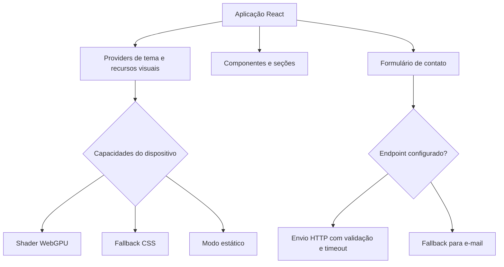

<div align="center">

# Barthy Web Studio V2

**Portfólio institucional desenvolvido com React e TypeScript para apresentar projetos reais, soluções digitais e minha atuação em desenvolvimento web.**


</div>

## Sobre o projeto

A Barthy Web Studio V2 é a nova versão do meu portfólio profissional e institucional. O projeto foi criado para comunicar com clareza quem eu sou, quais problemas consigo resolver e como transformo necessidades de negócio em experiências digitais funcionais.

Mais do que uma landing page, esta aplicação demonstra minha capacidade de planejar, desenvolver, validar e documentar uma solução front-end completa, com atenção a experiência do usuário, acessibilidade, responsividade, desempenho e manutenção.

## O que este projeto demonstra

- Desenvolvimento front-end com React e TypeScript
- Estruturação de componentes reutilizáveis e responsabilidades bem separadas
- Implementação fiel de identidade visual e experiência responsiva
- Progressive enhancement para recursos visuais avançados
- Acessibilidade aplicada a navegação, formulários e animações
- Validação robusta de formulários e tratamento de falhas
- Criação de verificações automatizadas de qualidade
- Organização de código, documentação e preparação para deploy
- Visão de produto aplicada a uma necessidade comercial real

## Minha atuação

Projeto concebido e desenvolvido por **Gabriel Brasil**, com responsabilidade sobre:

- definição da proposta e da arquitetura da página
- organização do conteúdo e da experiência de navegação
- desenvolvimento dos componentes e comportamentos da interface
- implementação dos temas claro e escuro
- criação dos modos visuais e fallbacks
- acessibilidade e navegação por teclado
- validação do formulário de briefing
- testes estruturais e documentação técnica
- preparação do fluxo de publicação

## Destaques técnicos

### Experiência visual adaptativa

O Hero utiliza progressive enhancement para entregar a melhor experiência que o navegador e o dispositivo suportam:

| Modo | Comportamento |
| --- | --- |
| `shader` | Renderização avançada quando WebGPU está disponível |
| `css-motion` | Fallback animado quando o shader não pode ser utilizado |
| `static` | Experiência sem movimento para usuários com essa preferência |

A aplicação também considera economia de dados, suporte a `backdrop-filter`, estado de carregamento e falhas do recurso visual. O conteúdo permanece acessível mesmo sem animações.

### Formulário preparado para cenários reais

O formulário de briefing inclui:

- validação individual por campo
- mensagens de erro associadas aos inputs
- foco automático no primeiro erro
- estados de carregamento, sucesso e falha
- preservação dos dados quando o envio falha
- timeout e cancelamento com `AbortController`
- validação do status e do corpo da resposta
- honeypot contra bots simples
- fallback para contato por e-mail

O envio utiliza um endpoint configurável por ambiente. Nenhuma credencial privada é exposta no front-end.

### Acessibilidade

Entre os recursos implementados estão:

- HTML semântico e hierarquia de títulos
- link para pular ao conteúdo principal
- navegação completa por teclado
- foco visível e controle de foco no menu móvel
- fechamento do menu com a tecla Escape
- retorno de foco ao elemento de origem
- mensagens de formulário com `aria-live`
- suporte a `prefers-reduced-motion`
- nomes acessíveis para controles interativos

### Qualidade automatizada

O projeto possui comandos próprios para verificar conteúdo, acessibilidade estrutural, contratos responsivos, tipagem e build:

```bash
pnpm quality
```

Esse fluxo executa:

```bash
pnpm audit:content
pnpm audit:a11y
pnpm test:responsive
pnpm typecheck
pnpm build
```

## Stack

### Desenvolvimento

- React 18
- TypeScript
- Vite
- Tailwind CSS
- CSS nativo
- Anime.js
- Shaders com carregamento sob demanda
- Lucide React

### Qualidade e entrega

- pnpm
- TypeScript Project References
- scripts próprios de auditoria
- GitHub Actions
- build automatizado
- Cloudflare Pages como destino de publicação

## Arquitetura



## Estrutura principal

```text
src/
  app/              composição da aplicação e providers
  components/       componentes organizados por domínio
  data/             conteúdo e configurações da interface
  hooks/            comportamentos reutilizáveis
  lib/              utilitários e fluxo de contato
  motion/           animações progressivas
  styles/           estilos globais
  theme/            tema e persistência
  visual/           detecção de capacidades e modos visuais
scripts/            auditorias e verificações automatizadas
docs/               documentação de produção
public/              arquivos públicos e headers
```

## Projetos apresentados

A experiência destaca trabalhos que representam diferentes frentes da minha atuação:

- **Levens:** sistemas, processos, suporte técnico e automações aplicadas a uma operação real
- **PNQC:** plataforma educacional com autenticação, trilhas de aprendizagem, avaliações e progresso
- **Hermes:** aplicação Full Stack autoral para organização pessoal, comercial, financeira e operacional

## Como executar

### Requisitos

- Node.js 22.13 ou superior
- pnpm 11.9

```bash
git clone https://github.com/g4brielbr4sil/barthy-web-studio-v2.git
cd barthy-web-studio-v2
pnpm install
cp .env.example .env.local
pnpm dev
```

Variáveis disponíveis:

```env
VITE_BARTHY_WHATSAPP_URL=
VITE_BARTHY_CONTACT_ENDPOINT=
```

Variáveis com prefixo `VITE_` são públicas no navegador e não devem armazenar segredos.

## Status

A aplicação está em validação final antes da publicação definitiva.

Próximas etapas:

- concluir testes em dispositivos e navegadores reais
- configurar os canais oficiais de contato
- adicionar screenshots finais desktop e mobile
- confirmar os headers de segurança
- publicar a URL oficial
- remover o bloqueio temporário de indexação

O checklist completo está em [`docs/PRODUCTION_CHECKLIST.md`](docs/PRODUCTION_CHECKLIST.md).

## Autor

**Gabriel Brasil**

Estudante de Análise e Desenvolvimento de Sistemas e desenvolvedor com foco em aplicações web, automações, melhoria de processos e construção de soluções digitais para necessidades reais.

GitHub: [@g4brielbr4sil](https://github.com/g4brielbr4sil)

## Licença

Código, marca, identidade e conteúdo protegidos pela licença disponível em [`LICENSE`](LICENSE).
