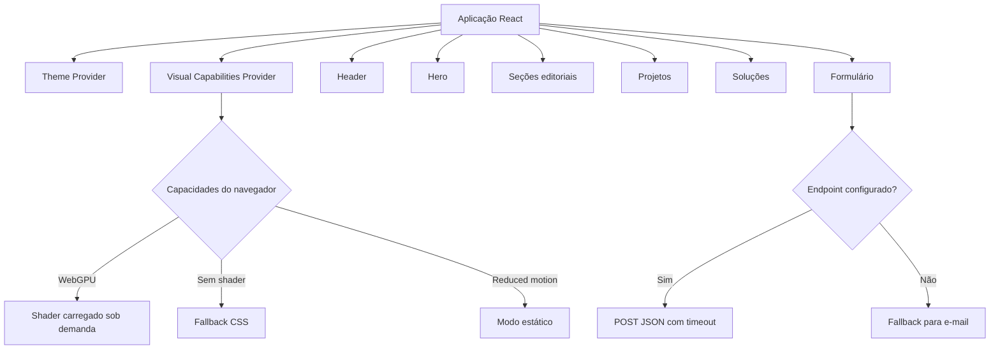

# Barthy Web Studio V2

A V2 é a nova experiência institucional da Barthy Web Studio, projeto que criei para apresentar soluções digitais, processos e projetos de forma mais direta, visual e profissional.

Enquanto a V1 funciona como uma apresentação comercial mais extensa, esta versão busca uma narrativa mais enxuta, com foco em posicionamento, projetos reais e contato.

## Visão rápida

| Item | Descrição |
| --- | --- |
| Tipo | Site institucional e portfólio comercial |
| Versão | V2 |
| Status | Em validação visual |
| Repositório | Público |
| Formulário | Implementado, depende de endpoint configurado |
| Indexação | Temporariamente bloqueada com `noindex, nofollow` |
| Licença | Proprietária |

## O que a V2 apresenta

A página foi organizada para mostrar:

- o posicionamento da Barthy Web Studio
- as frentes de presença digital, sistemas e operação
- projetos e experiências aplicadas
- o processo de trabalho
- soluções disponíveis
- canais de contato
- um briefing inicial para novos projetos

Os projetos apresentados são:

- Levens, como experiência profissional em tecnologia, sistemas e processos
- PNQC, como plataforma educacional desenvolvida diretamente
- Hermes, como aplicação Full Stack autoral

## Estrutura da página

```text
Header
Hero
Sobre a Barthy
Projetos
Soluções
Processo
Contato
Footer
```

## Experiência visual

O Hero utiliza progressive enhancement para escolher a melhor experiência disponível em cada navegador.

| Modo | Quando é usado |
| --- | --- |
| `shader` | WebGPU disponível, movimento permitido e shader carregado |
| `css-motion` | shader indisponível ou com falha |
| `static` | preferência por movimento reduzido ativada |

A aplicação verifica suporte a WebGPU, `backdrop-filter`, economia de dados, movimento reduzido e estado de carregamento do shader.

O conteúdo e a navegação continuam disponíveis mesmo quando a animação principal não é executada.

### Estado atual da animação

A estrutura de fallback está pronta, mas ainda estou ajustando o comportamento visual em alguns dispositivos, resoluções e navegadores.

Antes da publicação definitiva, ainda preciso validar:

- celulares reais
- tablets e notebooks
- monitores ultrawide
- Safari
- navegadores sem WebGPU
- diferentes densidades de pixel
- leitura completa sem animação

## Funcionalidades

### Formulário de briefing

O formulário coleta:

- nome
- WhatsApp
- e-mail opcional
- empresa ou projeto
- tipo de solução
- contexto da necessidade

O fluxo inclui:

- validação por campo
- foco no primeiro erro
- mensagens associadas aos inputs
- estados de carregamento, sucesso e falha
- preservação dos dados quando o envio não é confirmado
- fallback para contato por e-mail
- honeypot para bots simples
- timeout da requisição
- cancelamento com `AbortController`
- validação do status e do corpo da resposta
- bloqueio de mensagens de sucesso falsas

O envio depende da variável `VITE_BARTHY_CONTACT_ENDPOINT`. Sem endpoint configurado, nenhum dado é enviado online.

### Acessibilidade

A interface inclui:

- link para pular ao conteúdo
- regiões semânticas
- hierarquia de títulos
- navegação por teclado
- foco visível
- menu móvel com controle de foco
- suporte à tecla Escape
- retorno de foco ao fechar o menu
- nomes acessíveis em controles animados
- mensagens de erro associadas aos campos
- `aria-live` para o status do formulário
- suporte a movimento reduzido

### Responsividade

O projeto possui verificações automatizadas para contratos responsivos e regras que ajudam a detectar overflow e regressões de layout.

Esses testes não substituem a validação manual em dispositivos reais, mas ajudam a evitar problemas durante a evolução da interface.

## Arquitetura



## Stack

### Aplicação

- React 18
- TypeScript
- Vite
- Tailwind CSS
- CSS nativo
- Anime.js
- biblioteca `shaders`
- Lucide React

### Qualidade e entrega

- pnpm
- TypeScript project references
- GitHub Actions
- auditoria estrutural de acessibilidade
- testes de contratos responsivos
- build automatizado
- auditoria de dependências
- Cloudflare Pages como destino de publicação

A V2 não utiliza Material UI, Radix UI, React Router, GSAP, Recharts ou React Hook Form.

## Estrutura do projeto

```text
src/
  app/              composição principal e providers
  components/
    contact/        formulário e canais de contato
    header/         navegação desktop e mobile
    hero/           conteúdo e fundos visuais
    projects/       projetos apresentados
    sections/       seções editoriais
    solutions/      arquitetura de soluções
    ui/             componentes reutilizáveis
  data/             navegação e conteúdo
  hooks/            comportamento e preferências
  lib/              contato e utilitários
  motion/           animações progressivas
  styles/           estilos globais
  theme/            tema e persistência
  visual/           capacidades e modos visuais
scripts/            auditorias e contratos automatizados
docs/               checklist de produção
public/              arquivos públicos e headers
```

## Rodando localmente

### Requisitos

- Node.js 22.13 ou superior
- pnpm 11.9

```bash
pnpm install
pnpm dev
```

Crie o arquivo local de ambiente:

```bash
cp .env.example .env.local
```

```env
VITE_BARTHY_WHATSAPP_URL=
VITE_BARTHY_CONTACT_ENDPOINT=
```

Variáveis `VITE_` são públicas no navegador e não devem conter senhas, tokens ou chaves administrativas.

## Validação

```bash
pnpm audit:a11y
pnpm test:responsive
pnpm typecheck
pnpm build
pnpm audit --prod
```

Checklist principal:

1. navegação por teclado
2. temas claro e escuro
3. movimento reduzido
4. carregamento e falha do shader
5. formulário sem endpoint
6. formulário com endpoint de teste
7. celulares e navegadores reais
8. ausência de overflow horizontal
9. leitura completa sem animação

## Publicação

Configuração planejada para o Cloudflare Pages:

```text
Repositório: g4brielbr4sil/barthy-web-studio-v2
Branch de produção: main
Comando de build: pnpm build
Diretório de saída: dist
Node.js: 22.13 ou superior
```

Antes de liberar a versão definitiva, ainda precisam ser confirmados:

- URL oficial
- WhatsApp
- endpoint do formulário
- imagens finais
- textos e projetos apresentados
- comportamento visual em dispositivos reais
- headers de segurança
- remoção do `noindex`

Consulte [`docs/PRODUCTION_CHECKLIST.md`](docs/PRODUCTION_CHECKLIST.md).

## V1 e V2

| V1 | V2 |
| --- | --- |
| dark-first | light-first |
| apresentação comercial extensa | narrativa mais direta |
| muitos blocos operacionais | foco em projetos e posicionamento |
| Material UI, Radix, GSAP e Motion | Anime.js, CSS e shader |
| integração direta com Hermes | endpoint genérico configurável |
| mais componentes | experiência mais enxuta |

A V1 continua como parte da história técnica da Barthy. A V2 assume o protagonismo depois da validação e da publicação definitiva.

## Próximos passos

- estabilizar a animação entre dispositivos e resoluções
- concluir os testes físicos e no Safari
- configurar os canais reais de contato
- publicar um preview aprovado
- produzir screenshots desktop e mobile
- remover o `noindex` na publicação definitiva
- registrar a URL final no repositório

Desenvolvido por **Gabriel Brasil** para a **Barthy Web Studio**.

Código, marca, identidade e conteúdo protegidos pela licença disponível em [`LICENSE`](LICENSE).