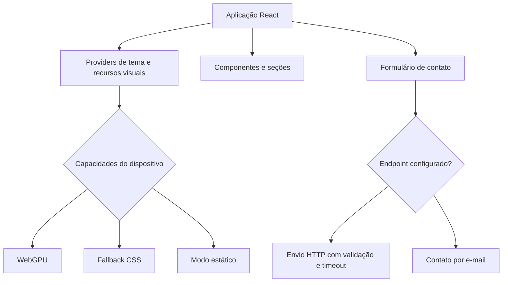

<div align="center">

# Barthy Web Studio

**Produtos digitais, sistemas e automações para pequenos negócios.**


</div>

## Sobre o projeto

A **Barthy Web Studio** é uma iniciativa autoral voltada à criação de soluções digitais para pequenos negócios, combinando presença web, sistemas, automações e organização de processos comerciais.

Este repositório contém a versão atual do site institucional da marca. O projeto também funciona como base prática para explorar produto, interface, acessibilidade, performance, integrações e qualidade de software.

## Linhas de atuação

- **BWS Web:** sites, landing pages, portfólios e presença digital.
- **BWS Systems:** produtos próprios e sistemas para organizar processos reais de negócio.
- **BWS Automations:** integrações, automações, bots, notificações e IA quando houver ganho claro.
- **BWS Care:** manutenção, hospedagem, pequenas alterações e monitoramento recorrente.

## O que foi construído

- interface em React e TypeScript
- temas claro e escuro
- navegação responsiva por seções
- menu móvel com controle de foco
- formulário de briefing com validação e tratamento de falhas
- experiência visual com WebGPU e alternativas em CSS
- suporte a `prefers-reduced-motion`
- verificações automatizadas de conteúdo, acessibilidade, responsividade, tipagem e build
- fluxo de publicação no Cloudflare Pages

## Cases apresentados

### PNQC

Plataforma web de formação de cuidadores com autenticação, perfis de acesso, cursos, módulos, aulas, progresso sequencial e avaliações com nota mínima de 70%.

Stack principal: React, TypeScript, Vite, Supabase e PostgreSQL.

Certificados, badges e áreas administrativas permanecem em evolução e não são apresentados como recursos concluídos.

### Hermes

Aplicação Full Stack autoral que evoluiu de um Personal OS para uma operação multiagente com CRM, pipeline, jobs, workers, policies, aprovações humanas, auditoria e infraestrutura própria.

Stack principal: React, TypeScript, Python, FastAPI, SQLAlchemy, SQLite e Docker.

A comunicação externa permanece bloqueada por padrão e ações sensíveis passam por regras e aprovação humana.

## Decisão sobre projetos em pesquisa

O **RadarDF** não faz parte da seleção pública atual de cases da home. A ideia permanece em pesquisa e desenvolvimento, sem receber o mesmo peso de produtos já implementados.

## Minha atuação

Sou responsável por:

- levantamento de necessidades
- definição da solução
- arquitetura da aplicação
- organização do conteúdo e navegação
- desenvolvimento dos componentes
- temas e recursos visuais progressivos
- acessibilidade e navegação por teclado
- formulário de briefing
- testes estruturais
- documentação técnica
- preparação da publicação

## Modos visuais

O Hero escolhe o modo adequado para cada ambiente:

| Modo | Quando é usado |
| --- | --- |
| `shader` | quando WebGPU está disponível |
| `css-motion` | quando o shader não pode ser usado |
| `static` | quando o usuário prefere menos movimento |

A aplicação também considera economia de dados, visibilidade da página, suporte a `backdrop-filter` e falhas de carregamento. Recursos visuais não são dependência para acessar o conteúdo.

## Formulário de briefing

O formulário possui:

- validação por campo
- mensagens de erro ligadas aos inputs
- foco automático no primeiro campo inválido
- estados de carregamento, sucesso e falha
- preservação dos dados quando o envio falha
- timeout e cancelamento com `AbortController`
- validação do status e corpo da resposta
- honeypot contra bots simples
- alternativa de contato por e-mail

O endpoint é configurado por ambiente. Credenciais privadas não ficam no frontend.

## Acessibilidade

O projeto inclui:

- HTML semântico
- hierarquia de títulos
- skip link
- navegação por teclado
- foco visível
- controle e retorno de foco no menu móvel
- mensagens de formulário com `aria-live`
- suporte a movimento reduzido
- nomes acessíveis para controles interativos
- testes de responsividade

## Tecnologias

### Aplicação

- React 18
- TypeScript
- Vite
- Tailwind CSS
- CSS nativo
- Anime.js
- Lucide React

### Recursos visuais

- WebGPU carregado sob demanda
- fallback animado em CSS
- modo estático para movimento reduzido

### Qualidade e entrega

- pnpm
- TypeScript Project References
- scripts próprios de auditoria
- GitHub Actions
- build automatizado
- Cloudflare Pages

## Arquitetura



## Estrutura principal

```text
src/
  app/
  components/
  data/
  hooks/
  lib/
  motion/
  styles/
  theme/
  visual/
scripts/
docs/
public/
```

## Como executar

### Requisitos

- Node.js 22.13 ou superior
- pnpm 11.9

```bash
git clone https://github.com/g4brielbr4sil/barthy-web-studio-v2.git
cd barthy-web-studio-v2
pnpm install
cp .env.example .env.local
pnpm dev
```

### Variáveis de ambiente

```env
VITE_BARTHY_WHATSAPP_URL=
VITE_BARTHY_CONTACT_ENDPOINT=
VITE_BARTHY_SITE_URL=
VITE_BARTHY_OG_IMAGE=
VITE_BARTHY_ALLOW_INDEXING=false
```

`VITE_BARTHY_SITE_URL` centraliza canonical, Open Graph e sitemap. A indexação só deve ser liberada quando a URL oficial HTTPS estiver definida.

Tudo que começa com `VITE_` é exposto ao navegador. Senhas, tokens e segredos não devem usar esse prefixo.

## Validação

```bash
pnpm quality
```

O comando executa auditorias de conteúdo, acessibilidade, responsividade, tipagem e build.

## Autor

**Gabriel Brasil**  
Desenvolvedor Full Stack e Analista de Sistemas

- Portfólio: [gabrielbrasil.dev](https://gabrielbrasil.dev)
- LinkedIn: [gabrielbrasildev](https://www.linkedin.com/in/gabrielbrasildev)
- GitHub: [@g4brielbr4sil](https://github.com/g4brielbr4sil)

## Licença

Código, marca, identidade e conteúdo protegidos pela licença disponível em [`LICENSE`](LICENSE).
