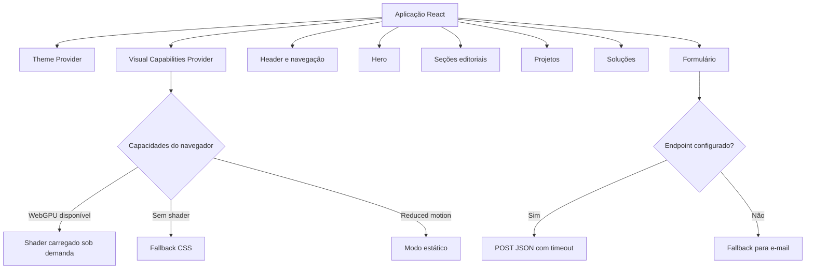

# Barthy Web Studio V2

Segunda versão do site institucional da Barthy Web Studio, operação autoral de soluções digitais para pequenos negócios.

A Barthy Web Studio não se resume a uma landing page. A operação reúne presença digital, desenvolvimento web, sistemas internos, captação de leads, CRM, automações, integrações, propostas comerciais, suporte e organização de processos.

Este repositório contém a experiência web V2 da marca, com direção editorial, interface responsiva, progressive enhancement e apresentação de projetos aplicados.

## Visão geral

| Item | Situação |
| --- | --- |
| Tipo | Site institucional e portfólio comercial |
| Versão | V2 |
| Repositório | Público |
| Produção definitiva | Ainda não aprovada |
| Indexação | Bloqueada temporariamente com `noindex, nofollow` |
| Formulário | Implementado, depende de endpoint configurado |
| Licença | Proprietária |

A V2 ainda não deve substituir a versão anterior nem ser tratada como produção definitiva antes da validação visual em dispositivos reais, configuração dos canais de contato e aprovação do conteúdo final.

## Objetivo do projeto

O site foi criado para apresentar de forma clara:

- o posicionamento da Barthy Web Studio
- as frentes de presença digital, sistemas e operação
- o processo de trabalho
- projetos e experiências aplicadas
- canais de contato
- um briefing inicial para novos projetos

A interface busca equilibrar impacto visual, leitura, acessibilidade e desempenho sem depender de um único recurso gráfico.

## Estrutura da experiência

O código organiza a página em componentes independentes:

```text
Header
Hero
Sobre a Barthy
Projetos
Soluções
Processo
Contato
Footer
```

Os projetos apresentados no site são:

- Levens, como experiência profissional e funcional em tecnologia e governança
- PNQC, como plataforma educacional desenvolvida diretamente
- Hermes, como aplicação Full Stack autoral

As descrições devem preservar a diferença entre experiência profissional, desenvolvimento direto e propriedade do código.

## Sistema visual

### Progressive enhancement

O Hero escolhe o modo visual de acordo com as capacidades reais do navegador e as preferências do usuário.

| Modo | Condição |
| --- | --- |
| `shader` | WebGPU disponível, economia de dados desativada, movimento permitido e shader carregado |
| `css-motion` | shader indisponível, não carregado ou com falha |
| `static` | `prefers-reduced-motion` ativado |

O sistema detecta:

- disponibilidade de WebGPU
- suporte a `backdrop-filter`
- preferência por movimento reduzido
- modo de economia de dados
- estado de carregamento do shader

A página mantém conteúdo e navegação mesmo quando o shader não é executado.

### Estado real da animação

O mecanismo de fallback está implementado no código, mas a experiência visual ainda apresenta comportamento inconsistente em alguns dispositivos e resoluções.

Portanto:

- a animação não está declarada como totalmente validada
- testes em dispositivos físicos ainda são necessários
- Safari, navegadores sem WebGPU e telas com diferentes densidades precisam de revisão
- o conteúdo deve continuar legível mesmo quando o movimento não aparecer
- a publicação definitiva depende dessa validação

## Formulário de briefing

O formulário coleta:

- nome
- WhatsApp
- e-mail opcional
- empresa ou projeto
- tipo de solução
- contexto da necessidade

Proteções e comportamentos implementados na branch:

- validação por campo
- foco automático no primeiro erro
- mensagens associadas aos inputs
- estados de carregamento, sucesso, erro e configuração ausente
- preservação dos dados quando o envio não é confirmado
- fallback para contato por e-mail
- honeypot para bots simples
- timeout de requisição
- cancelamento por `AbortController`
- validação do status e do corpo da resposta
- ausência de mensagem de sucesso falsa

O endpoint é obtido por variável de ambiente. Nenhum envio online ocorre quando ele não está configurado.

## Acessibilidade

A implementação inclui:

- link para pular ao conteúdo
- regiões semânticas
- hierarquia de títulos
- navegação por teclado
- foco visível
- menu móvel com controle de foco
- suporte a Escape e retorno de foco
- nomes acessíveis em controles animados
- mensagens de erro associadas aos campos
- `aria-live` para status do formulário
- tratamento de movimento reduzido
- conteúdo textual mantido fora de elementos puramente decorativos

A branch também contém uma auditoria estrutural automatizada para contratos de acessibilidade específicos do projeto.

## Responsividade

O projeto possui verificações automatizadas de contratos responsivos e regras para evitar overflow mascarado.

Essas verificações ajudam a detectar regressões no código, mas não substituem testes manuais em:

- celulares reais
- tablets
- notebooks
- monitores ultrawide
- diferentes densidades de pixel
- navegadores com e sem WebGPU

## Arquitetura



## Stack técnica

### Aplicação

- React 18
- TypeScript
- Vite
- Tailwind CSS
- CSS nativo
- Anime.js
- biblioteca `shaders`
- Lucide React

### Qualidade e entrega

- pnpm
- TypeScript project references
- GitHub Actions
- auditoria estrutural de acessibilidade
- teste de contratos responsivos
- build automatizado
- auditoria de dependências
- Cloudflare Pages como destino de publicação

A V2 não utiliza Material UI, Radix UI, React Router, GSAP, Recharts ou React Hook Form.

## Estrutura do projeto

```text
src/
  app/              composição principal e providers
  components/
    contact/        formulário e canais de contato
    header/         navegação desktop e mobile
    hero/           conteúdo e fundos visuais
    projects/       apresentação dos projetos
    sections/       seções editoriais
    solutions/      arquitetura de soluções
    ui/             componentes reutilizáveis
  data/             navegação e conteúdo dos projetos
  hooks/            comportamento e preferências
  lib/              contato e utilitários
  motion/           animações progressivas
  styles/           estilos globais
  theme/            tema e persistência
  visual/           detecção de capacidades e modos visuais
scripts/            auditorias e contratos automatizados
docs/               checklist de produção
public/              arquivos públicos e headers
```

## Desenvolvimento local

### Requisitos

- Node.js 22.13 ou superior
- pnpm 11.9

```bash
pnpm install
pnpm dev
```

## Variáveis de ambiente

Copie o arquivo de exemplo:

```bash
cp .env.example .env.local
```

```env
VITE_BARTHY_WHATSAPP_URL=
VITE_BARTHY_CONTACT_ENDPOINT=
```

Variáveis `VITE_` são incluídas no código entregue ao navegador. Elas não podem conter senhas, tokens privados, chaves administrativas ou qualquer outro segredo.

## Validação

```bash
pnpm audit:a11y
pnpm test:responsive
pnpm typecheck
pnpm build
pnpm audit --prod
```

Além dos comandos, a validação de publicação precisa incluir:

1. navegação por teclado
2. temas claro e escuro
3. movimento reduzido
4. carregamento e falha do shader
5. formulário sem endpoint
6. formulário com endpoint de teste
7. celulares e navegadores reais
8. ausência de overflow horizontal
9. leitura completa sem animação

## Publicação

Configuração prevista para Cloudflare Pages:

```text
Repositório: g4brielbr4sil/barthy-web-studio-v2
Branch de produção: main
Comando de build: pnpm build
Diretório de saída: dist
Node.js: 22.13 ou superior
```

Antes da publicação definitiva devem ser confirmados:

- domínio ou URL oficial
- WhatsApp
- endpoint do formulário
- imagens finais
- textos e projetos apresentados
- comportamento visual em dispositivos reais
- headers de segurança
- remoção consciente do `noindex`

Consulte [`docs/PRODUCTION_CHECKLIST.md`](docs/PRODUCTION_CHECKLIST.md).

## Segurança e privacidade

- nenhum segredo deve existir no frontend
- framing e MIME sniffing são restringidos pelos headers preparados
- permissões desnecessárias do navegador são bloqueadas
- o formulário não armazena dados localmente
- mensagens de sucesso dependem de confirmação do endpoint
- screenshots não podem exibir leads, contatos ou dados pessoais
- a marca, o design e o código são proprietários

## Diferença entre V1 e V2

| V1 | V2 |
| --- | --- |
| dark-first | light-first |
| maior quantidade de blocos | narrativa mais enxuta |
| interface técnica e modular | direção editorial e cinematográfica |
| integração direta com Hermes no formulário | endpoint genérico configurável |
| recursos amplos de UI | stack visual mais reduzida |

A V1 permanece como registro da evolução técnica. A V2 deve assumir o protagonismo somente depois de validada e publicada.

## Próximos passos confirmados

- estabilizar a animação entre dispositivos e resoluções
- concluir testes físicos e em Safari
- configurar os canais reais de contato
- publicar um preview aprovado
- produzir screenshots desktop e mobile
- remover `noindex` apenas na publicação definitiva
- documentar a URL final no repositório

## Autoria e licença

Projeto desenvolvido por Gabriel Brasil para a Barthy Web Studio.

Código, marca, identidade, conteúdo e documentação são proprietários. Consulte [`LICENSE`](LICENSE).