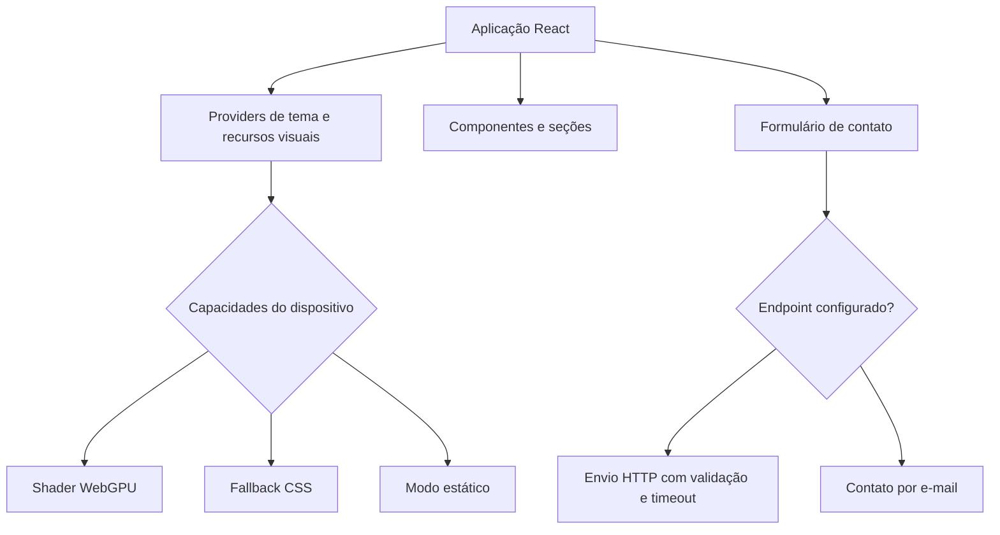

<div align="center">

# Barthy Web Studio V2

**Versão atual do site institucional e portfólio profissional da Barthy Web Studio.**


</div>

## Sobre o projeto

A Barthy Web Studio V2 é a versão atual do site da Barthy. Criei o projeto para apresentar meus trabalhos, explicar os serviços da marca e mostrar como penso produto, interface, acessibilidade e qualidade de código.

A aplicação usa uma direção visual mais editorial, mas sem depender dos efeitos para funcionar. O conteúdo continua acessível em dispositivos sem WebGPU, com economia de dados ou com preferência por menos movimento.

## O que eu construí

- interface em React e TypeScript
- temas claro e escuro
- navegação responsiva por seções
- menu móvel com controle de foco
- formulário de briefing com validação e tratamento de falhas
- experiência visual com WebGPU e alternativas em CSS
- suporte a `prefers-reduced-motion`
- verificações automatizadas de conteúdo, acessibilidade, responsividade, tipagem e build
- fluxo de publicação no Cloudflare Pages

## Minha atuação

Fui responsável por:

- proposta e arquitetura da página
- organização do conteúdo e da navegação
- desenvolvimento dos componentes
- implementação dos temas
- modos visuais e fallbacks
- acessibilidade e navegação por teclado
- formulário de briefing
- testes estruturais
- documentação técnica
- preparação da publicação

## Principais funcionalidades

- Hero em tela cheia com composição visual adaptativa
- navegação com indicação da seção ativa
- menu móvel com foco controlado, bloqueio de rolagem e fechamento por Escape
- seções de projetos, soluções, processo e contato
- alternância entre temas claro e escuro
- formulário com endpoint configurável
- alternativa de contato por e-mail
- painel de diagnóstico visual disponível apenas em desenvolvimento

## Modos visuais

O Hero escolhe o modo mais adequado para cada ambiente:

| Modo | Quando é usado |
| --- | --- |
| `shader` | quando WebGPU está disponível |
| `css-motion` | quando o shader não pode ser usado |
| `static` | quando o usuário prefere menos movimento |

A aplicação também considera economia de dados, visibilidade da página, suporte a `backdrop-filter` e falhas de carregamento. O site não deixa de funcionar quando um efeito visual falha.

## Formulário de briefing

O formulário possui:

- validação por campo
- mensagens de erro ligadas aos inputs
- foco automático no primeiro campo inválido
- estados de carregamento, sucesso e falha
- preservação dos dados quando o envio falha
- timeout e cancelamento com `AbortController`
- validação do status e do corpo da resposta
- honeypot contra bots simples
- alternativa de contato por e-mail

O endpoint é configurado por ambiente. Nenhuma credencial privada fica no front-end.

## Acessibilidade

O projeto inclui:

- HTML semântico
- hierarquia de títulos
- link para pular ao conteúdo
- navegação por teclado
- foco visível
- controle e retorno de foco no menu móvel
- mensagens de formulário com `aria-live`
- suporte a movimento reduzido
- nomes acessíveis para controles interativos
- testes próprios de responsividade

## Tecnologias

### Aplicação

- React 18
- TypeScript
- Vite
- Tailwind CSS
- CSS nativo
- Anime.js
- Lucide React

### Recursos visuais

- shader WebGPU carregado sob demanda
- fallback animado em CSS
- modo estático para movimento reduzido

### Qualidade e entrega

- pnpm
- TypeScript Project References
- scripts próprios de auditoria
- GitHub Actions
- build automatizado
- Cloudflare Pages

## Arquitetura



## Estrutura principal

```text
src/
  app/              composição da aplicação e providers
  components/       componentes organizados por domínio
  data/             conteúdo e configurações da interface
  hooks/            comportamentos reutilizáveis
  lib/              utilitários e fluxo de contato
  motion/           animações progressivas
  styles/           estilos globais
  theme/            tema e persistência
  visual/           detecção de capacidades e modos visuais
scripts/            auditorias e verificações automatizadas
docs/               documentação de produção
public/              arquivos públicos e headers
```

## Projetos apresentados

- **PNQC:** plataforma educacional com autenticação, trilhas de aprendizagem, avaliações e progresso
- **Hermes:** aplicação Full Stack autoral para organização comercial, operacional e automações controladas
- **RadarDF:** produto em desenvolvimento para centralizar e estruturar oportunidades de trabalho no Distrito Federal

## Como executar

### Requisitos

- Node.js 22.13 ou superior
- pnpm 11.9

```bash
git clone https://github.com/g4brielbr4sil/barthy-web-studio-v2.git
cd barthy-web-studio-v2
pnpm install
cp .env.example .env.local
pnpm dev
```

### Variáveis de ambiente

```env
VITE_BARTHY_WHATSAPP_URL=
VITE_BARTHY_CONTACT_ENDPOINT=
VITE_BARTHY_SITE_URL=
VITE_BARTHY_OG_IMAGE=
VITE_BARTHY_ALLOW_INDEXING=false
```

`VITE_BARTHY_WHATSAPP_URL` define o link usado no botão de WhatsApp.

`VITE_BARTHY_CONTACT_ENDPOINT` aponta para o endpoint que recebe o formulário.

`VITE_BARTHY_SITE_URL` centraliza canonical, Open Graph e sitemap. O build só libera indexação quando `VITE_BARTHY_ALLOW_INDEXING=true` e a URL oficial HTTPS está configurada. Previews devem manter essa variável como `false`.

No Vite, tudo que começa com `VITE_` vai para o navegador. Não coloque senha, token ou segredo nessas variáveis.

## Validação

```bash
pnpm quality
```

Esse comando executa:

```bash
pnpm audit:content
pnpm audit:a11y
pnpm test:responsive
pnpm typecheck
pnpm build
```

## Autor e contato

**Gabriel Brasil Barthy Elias**  
**Barthy Web Studio**

- GitHub: [@g4brielbr4sil](https://github.com/g4brielbr4sil)
- E-mail: [contato.barthywebstudio@gmail.com](mailto:contato.barthywebstudio@gmail.com)

## Licença

Código, marca, identidade e conteúdo protegidos pela licença disponível em [`LICENSE`](LICENSE).
