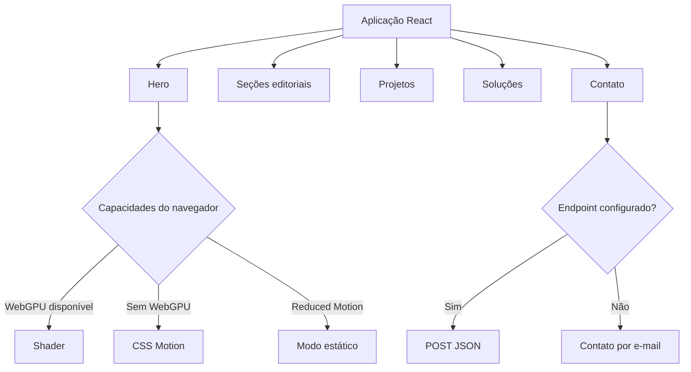

# Barthy Web Studio V2

Site institucional e apresentação digital da **Barthy Web Studio**, uma operação própria de soluções digitais para pequenos negócios.

A Barthy Web Studio não se resume a este site. A operação envolve estratégia, posicionamento, identidade visual, presença digital, desenvolvimento de sites e sistemas, propostas comerciais, captação de leads, CRM, automações, suporte e organização de processos.

Este repositório contém a **V2 da experiência web da marca**, construída como uma proposta editorial, cinematográfica, responsiva e acessível.

## Status

- **Aplicação:** implementada
- **Repositório:** público
- **Produção definitiva:** pendente de aprovação
- **Indexação:** bloqueada com `noindex, nofollow`
- **Formulário:** preparado, mas depende de endpoint confirmado
- **WhatsApp:** depende de URL confirmada
- **Licença:** proprietária

## Objetivo do site

Apresentar a Barthy Web Studio, suas áreas de atuação, processo de trabalho e projetos aplicados, criando uma experiência visual forte sem comprometer acessibilidade, responsividade e performance.

## Direção visual

| V1 | V2 |
| --- | --- |
| Dark-first | Light-first |
| Técnica e modular | Editorial e cinematográfica |
| Conteúdo aprofundado | Narrativa mais direta |
| Muitos blocos operacionais | Momentos visuais selecionados |
| Foco em estrutura | Foco em impacto e projetos |

## Stack confirmada

- React 18
- TypeScript
- Vite
- Tailwind CSS
- Anime.js
- CSS nativo
- Shaders com WebGPU
- Lucide React
- Cloudflare Pages como destino de publicação
- GitHub Actions

A V2 não utiliza Material UI, Radix UI, React Router, GSAP, Recharts ou React Hook Form.

## Funcionalidades

### Experiência visual

- Hero com shader carregado sob demanda
- fallback CSS quando WebGPU não está disponível
- modo estático para movimento reduzido
- temas claro e escuro
- preferência de tema persistida
- navegação por âncoras
- indicador de seção ativa
- menu mobile acessível

### Conteúdo

- apresentação do estúdio
- projetos e cases
- soluções organizadas por presença, sistemas e operação
- processo de trabalho
- canais de contato
- formulário de briefing inicial

### Formulário

- validação de campos
- foco no primeiro erro
- estados de carregamento, sucesso e falha
- preservação dos dados quando o endpoint não está configurado
- honeypot contra bots simples
- timeout e cancelamento de requisição
- confirmação do contrato de resposta
- nenhuma mensagem de sucesso falsa

## Arquitetura visual



## Progressive enhancement

A experiência visual possui três modos:

- `shader`: WebGPU disponível, movimento permitido e canvas carregado
- `css-motion`: fallback sem canvas para ausência ou falha do shader
- `static`: conteúdo completo sem animação para movimento reduzido

A página continua navegável e legível mesmo sem shader, aceleração gráfica, Anime.js ou `backdrop-filter`.

## Acessibilidade

- um único `h1`
- hierarquia semântica de títulos
- link para pular ao conteúdo
- menu móvel com foco contido
- fechamento por Escape
- retorno de foco
- alvos interativos mínimos
- foco visível
- navegação por teclado
- tabs com setas, Home e End
- labels e mensagens de erro associadas
- nome acessível estável para CTAs animados
- conteúdo textual sem duplicação visual
- suporte a `prefers-reduced-motion`

## Responsividade

O projeto possui contratos de regressão para comportamento responsivo e foi estruturado para funcionar entre 320 px e 2560 px sem mascarar overflow horizontal.

## Estrutura principal

```text
src/
  app/
  components/
    brand/
    contact/
    header/
    hero/
    projects/
    sections/
    solutions/
    ui/
  data/
  hooks/
  lib/
  motion/
  styles/
  theme/
  visual/
public/
scripts/
docs/
```

## Desenvolvimento

Requisitos:

- Node.js 22.13 ou superior
- pnpm 11.9

```bash
pnpm install
pnpm dev
```

## Validação

```bash
pnpm audit:a11y
pnpm test:responsive
pnpm typecheck
pnpm build
pnpm audit --prod
```

## Variáveis de ambiente

Copie `.env.example` para `.env.local`.

```env
VITE_BARTHY_WHATSAPP_URL=
VITE_BARTHY_CONTACT_ENDPOINT=
```

Variáveis com prefixo `VITE_` ficam públicas no navegador. Nunca coloque tokens, senhas ou segredos nesses campos.

## Publicação no Cloudflare Pages

Configuração prevista:

```text
Repositório: g4brielbr4sil/barthy-web-studio-v2
Branch de produção: main
Comando de build: pnpm build
Diretório de saída: dist
Node.js: 22.13 ou superior
```

Consulte [`docs/PRODUCTION_CHECKLIST.md`](docs/PRODUCTION_CHECKLIST.md) antes da publicação definitiva.

O bloqueio de indexação deve ser removido somente quando domínio, conteúdo, formulário, imagens e publicação estiverem aprovados.

## Screenshots

As imagens serão produzidas em conjunto após a validação do preview. Serão incluídas versões desktop e mobile do Hero, soluções, projetos e formulário, sem dados pessoais ou conteúdo não aprovado.

## Segurança

- headers de segurança preparados para Cloudflare Pages
- framing bloqueado
- MIME sniffing bloqueado
- políticas restritivas para câmera, microfone, localização, pagamentos e USB
- formulário com timeout e honeypot
- nenhuma chave secreta no frontend
- nenhum dado do formulário armazenado localmente pelo projeto

## Limitações atuais

- não existe deploy definitivo aprovado
- endpoint de contato ainda precisa ser confirmado
- URL de WhatsApp ainda precisa ser confirmada
- imagens editoriais definitivas ainda precisam ser aprovadas
- testes em dispositivos físicos e Safari ainda devem ser concluídos
- o chunk do shader permanece maior que o bundle inicial, mas é isolado e carregado sob demanda

## V1 e V2

A V1 permanece em repositório separado e representa uma direção anterior da presença digital. Nenhuma substituição da produção deve ser realizada sem comparação visual, validação do formulário e aprovação explícita.

## Licença

Código, design, marca, conteúdo e documentação são proprietários. Consulte [`LICENSE`](LICENSE).
