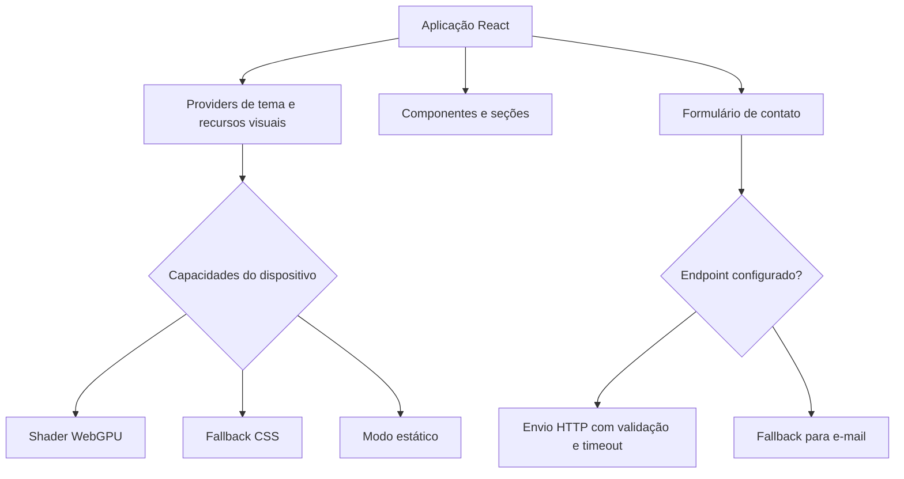

<div align="center">

# Barthy Web Studio V2

**Site institucional e portfólio profissional desenvolvido para apresentar projetos, soluções digitais e competências em desenvolvimento web.**


</div>

## Sobre o projeto

A Barthy Web Studio V2 é a evolução do site institucional da Barthy Web Studio. O projeto apresenta minha atuação, os serviços da marca e projetos desenvolvidos para necessidades reais de operação, educação e organização pessoal.

A aplicação combina uma direção visual editorial com arquitetura front-end organizada, componentes reutilizáveis, responsividade, acessibilidade e progressive enhancement. O objetivo é funcionar ao mesmo tempo como presença comercial da Barthy e como demonstração técnica para clientes, parceiros e recrutadores.

## O que este projeto demonstra

- Desenvolvimento front-end com React e TypeScript
- Arquitetura baseada em componentes e responsabilidades bem separadas
- Implementação de temas claro e escuro
- Progressive enhancement para recursos visuais avançados
- Fallbacks para diferentes capacidades do navegador e do dispositivo
- Acessibilidade aplicada à navegação, aos formulários e às animações
- Validação de formulários e tratamento de falhas
- Verificações automatizadas de conteúdo, responsividade, tipagem e build
- Organização de código, documentação e fluxo de entrega
- Visão de produto aplicada a uma operação comercial própria

## Minha atuação

Projeto concebido e desenvolvido por **Gabriel Brasil Barthy Elias**, com responsabilidade sobre:

- definição da proposta e da arquitetura da página
- organização do conteúdo e da navegação
- desenvolvimento dos componentes e comportamentos da interface
- implementação dos temas claro e escuro
- criação dos modos visuais e fallbacks
- acessibilidade e navegação por teclado
- validação do formulário de briefing
- testes estruturais e documentação técnica
- preparação do fluxo de publicação

## Principais funcionalidades

- Hero em tela cheia com composição visual adaptativa
- Navegação por seções com indicação da seção ativa
- Menu móvel com controle de foco, bloqueio de rolagem e fechamento por Escape
- Seções institucionais, projetos, soluções, processo e contato
- Alternância entre temas claro e escuro
- Formulário de briefing com validação e endpoint configurável
- Fallback de contato por e-mail
- Suporte a `prefers-reduced-motion`
- Painel de diagnóstico visual habilitado apenas para desenvolvimento

## Experiência visual adaptativa

O Hero utiliza progressive enhancement para selecionar o modo visual compatível com o ambiente:

| Modo | Comportamento |
| --- | --- |
| `shader` | Renderização avançada quando WebGPU está disponível |
| `css-motion` | Fallback animado quando o shader não pode ser utilizado |
| `static` | Composição sem movimento para usuários com essa preferência |

A aplicação também considera economia de dados, visibilidade da página, suporte a `backdrop-filter` e falhas de carregamento. O conteúdo permanece disponível mesmo sem animações ou canvas.

## Formulário de briefing

O formulário inclui:

- validação individual por campo
- mensagens de erro associadas aos inputs
- foco automático no primeiro campo inválido
- estados de carregamento, sucesso e falha
- preservação dos dados quando o envio falha
- timeout e cancelamento com `AbortController`
- validação do status e do corpo da resposta
- honeypot contra bots simples
- fallback para contato por e-mail

O envio utiliza um endpoint configurável por ambiente. Nenhuma credencial privada é armazenada no front-end.

## Acessibilidade e experiência de uso

Entre os recursos implementados estão:

- HTML semântico e hierarquia de títulos
- link para pular ao conteúdo principal
- navegação por teclado
- foco visível e controle de foco no menu móvel
- retorno de foco ao elemento de origem
- mensagens de formulário com `aria-live`
- suporte a movimento reduzido
- nomes acessíveis para controles interativos
- contratos responsivos verificados por script próprio

## Tecnologias

### Aplicação

- React 18
- TypeScript
- Vite
- Tailwind CSS
- CSS nativo
- Anime.js
- Lucide React

### Recursos visuais

- Shader WebGPU carregado sob demanda
- Fallback animado em CSS
- Modo estático para movimento reduzido

### Qualidade e entrega

- pnpm
- TypeScript Project References
- scripts próprios de auditoria
- GitHub Actions
- build automatizado
- Cloudflare Pages como destino de publicação

## Arquitetura



## Estrutura principal

```text
src/
  app/              composição da aplicação e providers
  components/       componentes organizados por domínio
  data/             conteúdo e configurações da interface
  hooks/            comportamentos reutilizáveis
  lib/              utilitários e fluxo de contato
  motion/           animações progressivas
  styles/           estilos globais
  theme/            tema e persistência
  visual/           detecção de capacidades e modos visuais
scripts/            auditorias e verificações automatizadas
docs/               documentação de produção
public/              arquivos públicos e headers
```

## Projetos apresentados

- **Levens:** sistemas, processos, suporte técnico e automações aplicadas a uma operação real
- **PNQC:** plataforma educacional com autenticação, trilhas de aprendizagem, avaliações e progresso
- **Hermes:** aplicação Full Stack autoral para organização pessoal, comercial, financeira e operacional

## Como executar

### Requisitos

- Node.js 22.13 ou superior
- pnpm 11.9

```bash
git clone https://github.com/g4brielbr4sil/barthy-web-studio-v2.git
cd barthy-web-studio-v2
pnpm install
cp .env.example .env.local
pnpm dev
```

### Variáveis de ambiente

```env
VITE_BARTHY_WHATSAPP_URL=
VITE_BARTHY_CONTACT_ENDPOINT=
```

`VITE_BARTHY_WHATSAPP_URL` define a URL utilizada pelo botão de contato via WhatsApp.

`VITE_BARTHY_CONTACT_ENDPOINT` define o endpoint responsável pelo envio do formulário de briefing.

Variáveis com prefixo `VITE_` são públicas no navegador e não devem armazenar segredos.

## Validação

```bash
pnpm quality
```

O fluxo executa:

```bash
pnpm audit:content
pnpm audit:a11y
pnpm test:responsive
pnpm typecheck
pnpm build
```

## Autor e contato

**Gabriel Brasil Barthy Elias**  
**Barthy Web Studio**

- GitHub: [@g4brielbr4sil](https://github.com/g4brielbr4sil)
- E-mail: [contato.barthywebstudio@gmail.com](mailto:contato.barthywebstudio@gmail.com)

## Licença

Código, marca, identidade e conteúdo protegidos pela licença disponível em [`LICENSE`](LICENSE).
